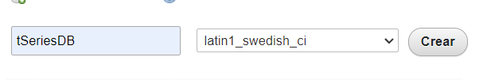
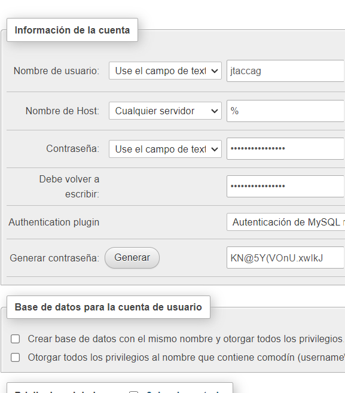
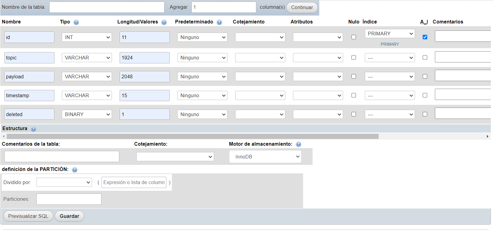
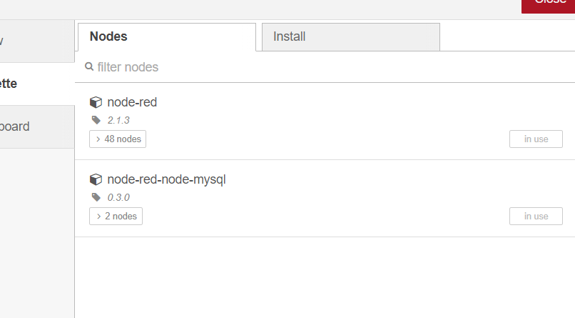
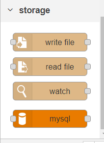
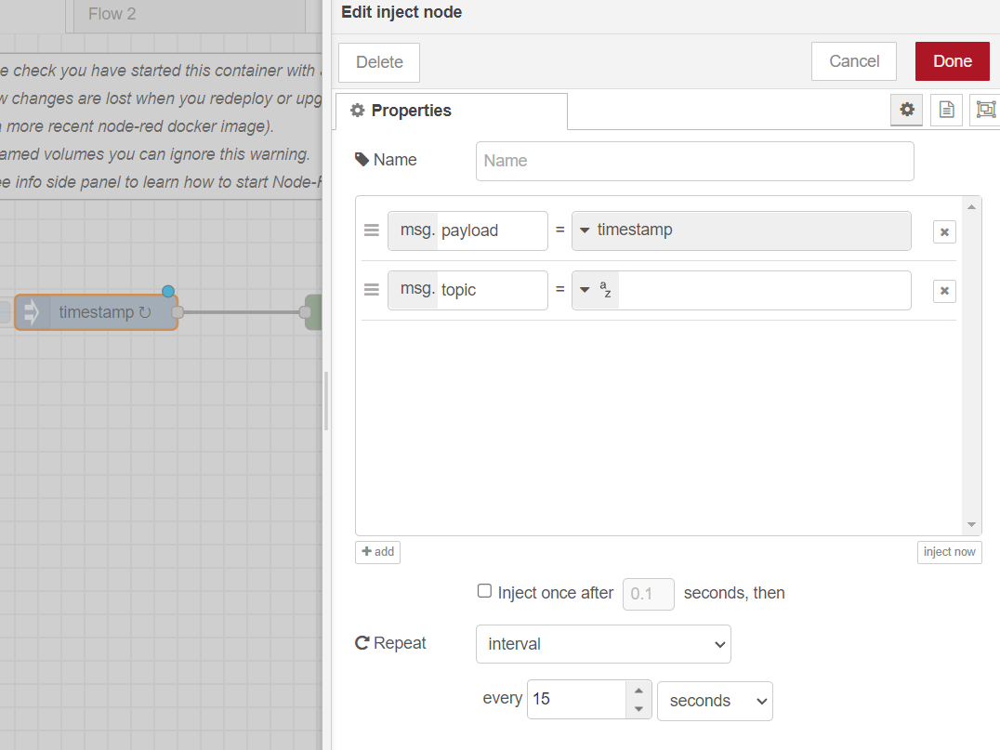
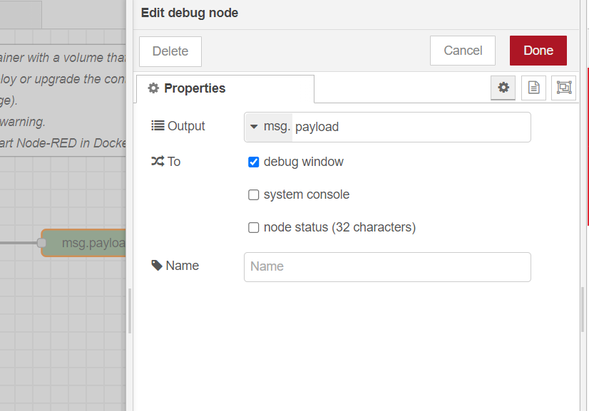
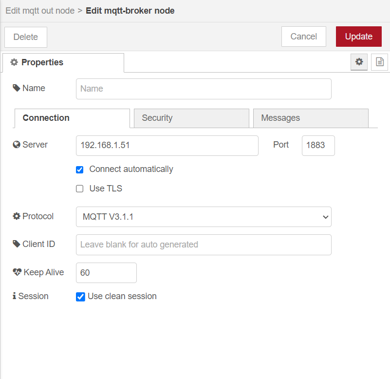
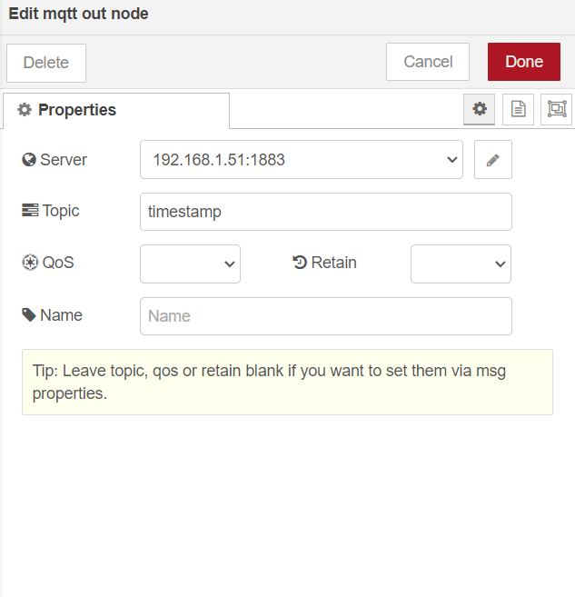

# Build Your Own IoT Platform 
## Building the Critical Components

### Creación de una base de datos principal de series temporales

- Creación de la base de datos en phpMyAdmin 
&nbsp;
- Creación de un usuario para administrar las base de datos 
&nbsp;
- Creación de una tabla de datos, con el esquema diseñado 
&nbsp;

### Instalación de nodos requeridos en Node-RED

- Agregar el nodo MySQL a la paleta Node-RED 
&nbsp;
- Nodo Mysql agregado 
&nbsp;

### Creación del primer flujo para la plataforma

- La primera secuencia de flujo en Node-RED con un inject node y debug node 
&nbsp;&nbsp;

#### Añadir la capacidad de publicación de MQTT

- Agregar un mqtt out node y configurar el mqtt broker 
&nbsp;&nbsp;
