# Build Your Own IoT Platform 
## Building the Critical Components

### Creación de una base de datos principal de series temporales

- Creación de la base de datos en phpMyAdmin 
&nbsp;
- Creación de un usuario para administrar las base de datos 
&nbsp;
- Creación de una tabla de datos, con el esquema diseñado 
&nbsp;

### Instalación de nodos requeridos en Node-RED

- Agregar el nodo MySQL a la paleta Node-RED 
&nbsp;
- Nodo Mysql agregado 
&nbsp;

### Creación del primer flujo para la plataforma

- La primera secuencia de flujo en Node-RED con un inject node y debug node 
&nbsp;&nbsp;

#### Añadir la capacidad de publicación de MQTT

- Agregar un mqtt out node y configurar el mqtt broker 
&nbsp;&nbsp; 
&nbsp; Vista del flujo con la capacidad de publicación mqtt 
&nbsp;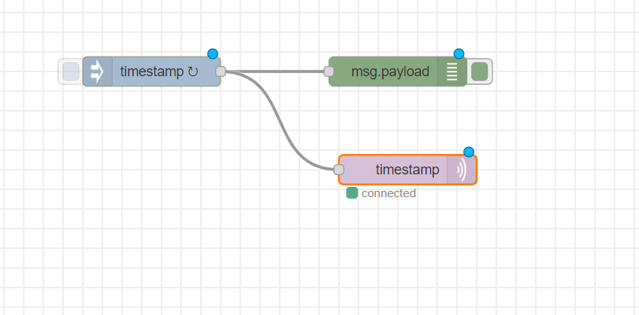

### Publicador de mensajes de API REST
- Configuración de un http input node  
&nbsp;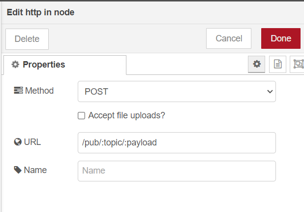
- Configuración de los nodos de creación de mensaje y creación de respuesta  
&nbsp;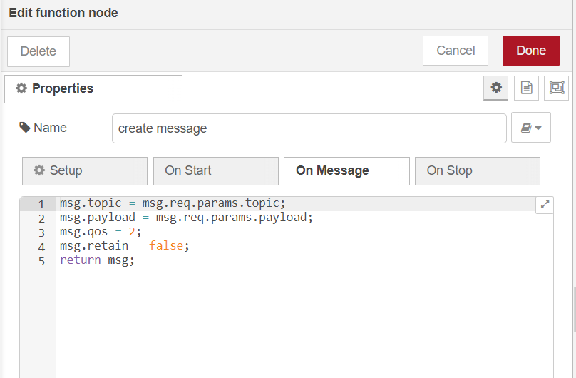&nbsp;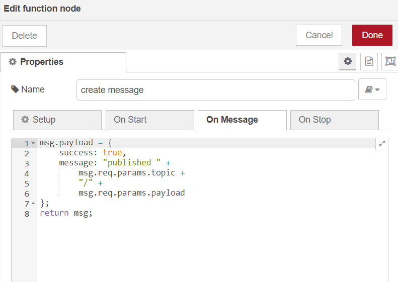
- Vista del flujo de la API de publicación de mensajes 
&nbsp;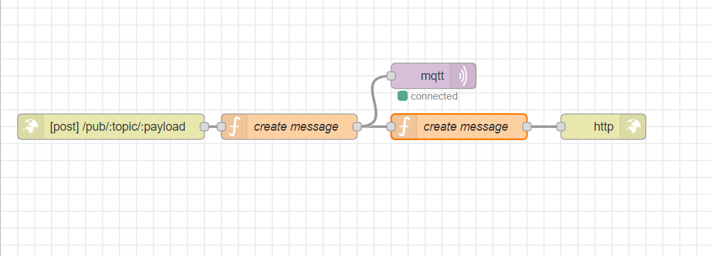
### Creación de un Database Listener
- Configuración del nodo mqtt input 
&nbsp;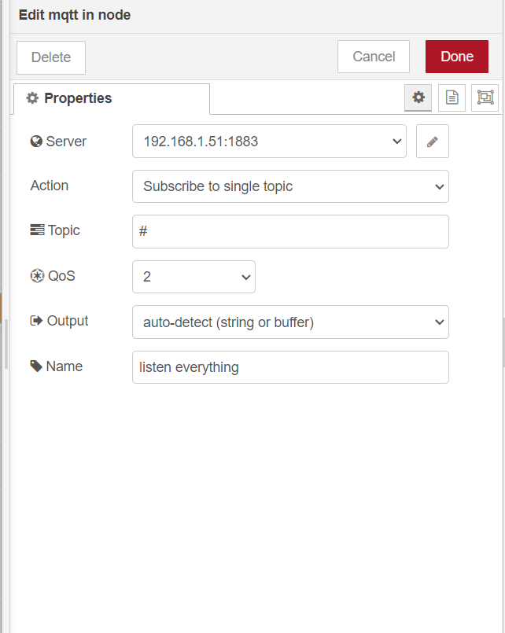
- Configuración del nodo función para la creación de querys  
&nbsp;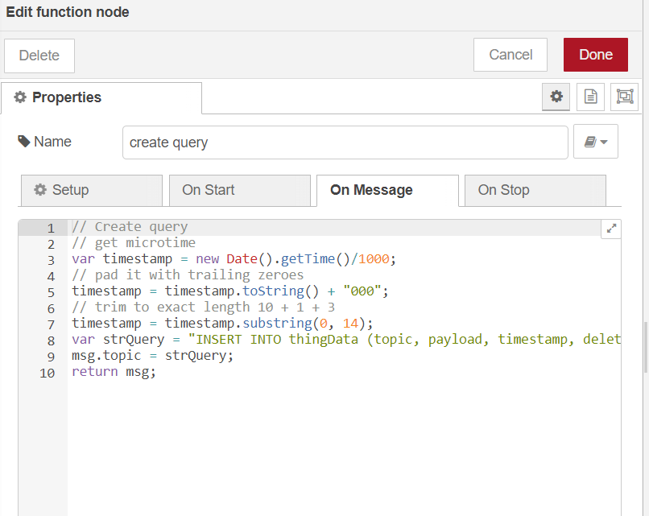
- Inclusión y configuración del nodo MySQL usando la base de datos para time-series creado anteriormente.
&nbsp;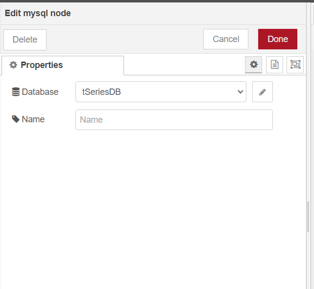&nbsp;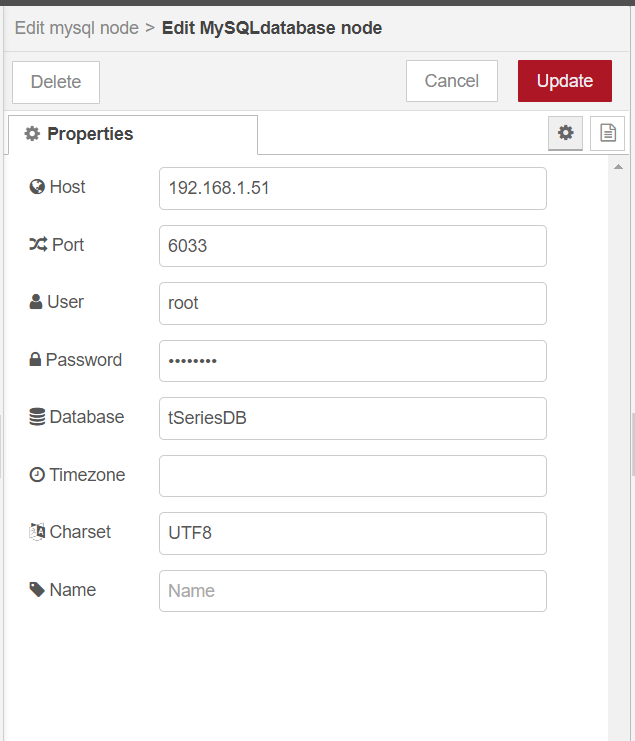 
- Vista del flujo con el nodo MySQL y Database Listener 
&nbsp;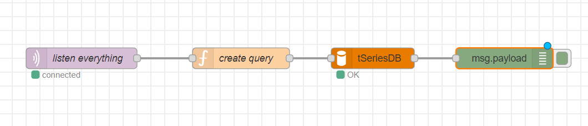

### REST API Message Retriever
- Configuración de los nodos http input 
&nbsp;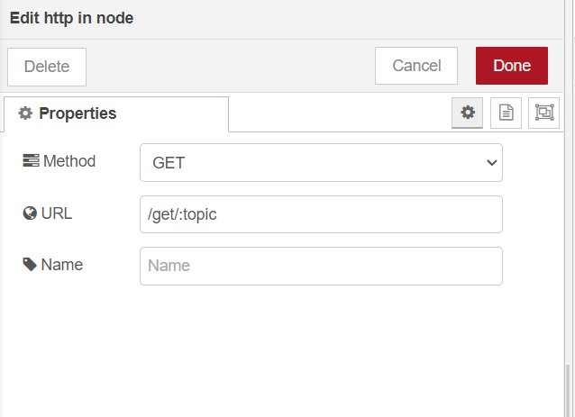&nbsp;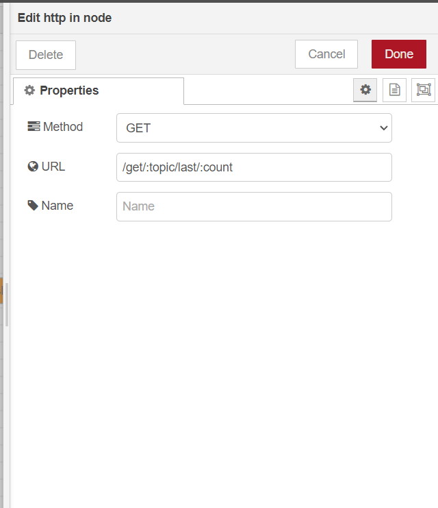
- Configuración del function node para la creación de querys 
&nbsp;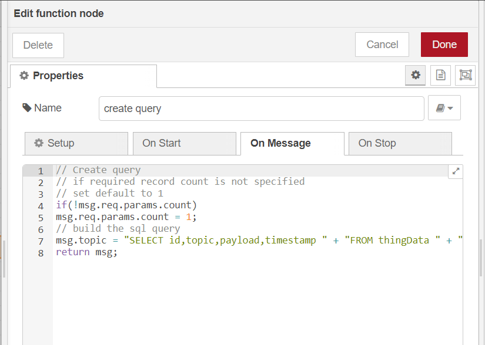 
- Flujo con la recuperación de mensajes del almacenamiento  
&nbsp;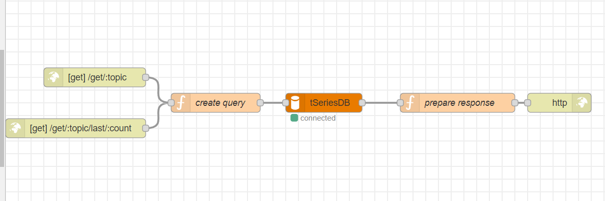 

### Verificar que todo funcione como se esperaba
- Verificación de la base de datos,  
&nbsp;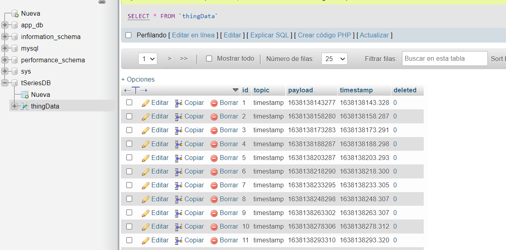 
- Verificación del primer flujo  
&nbsp;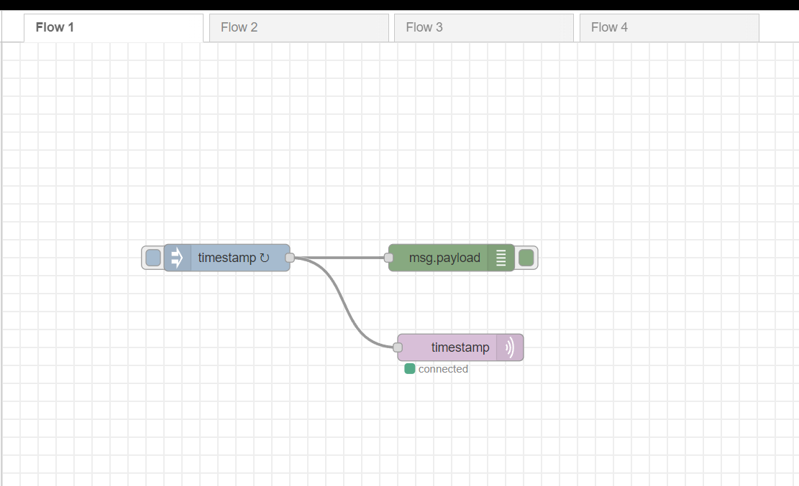 
- Verificación del segundo flujo flujo  
&nbsp;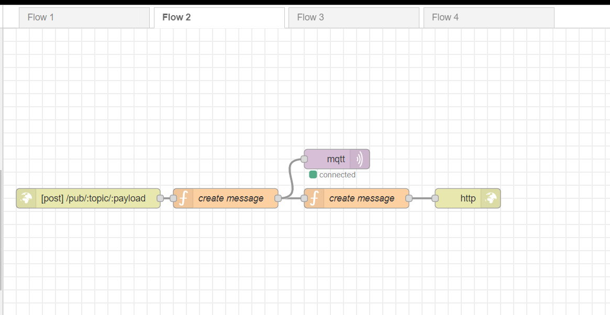 
- Verificación del tercer flujo flujo  
&nbsp;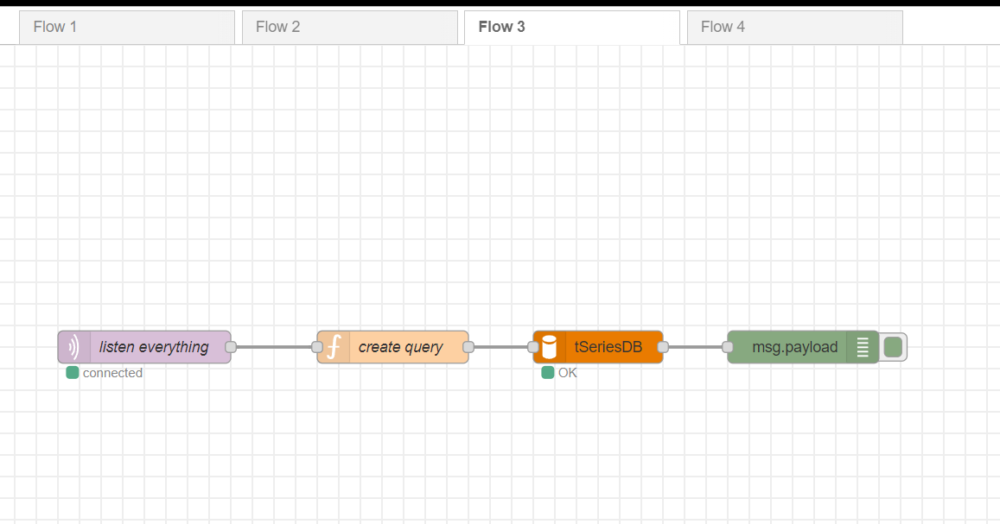
- Verificación del cuarto flujo  
&nbsp; 
### Ejecutar Node-RED en segundo plano de forma continua
- En este caso se usa docker para la ejecución en segundo plano y el despliegue automático.  
&nbsp;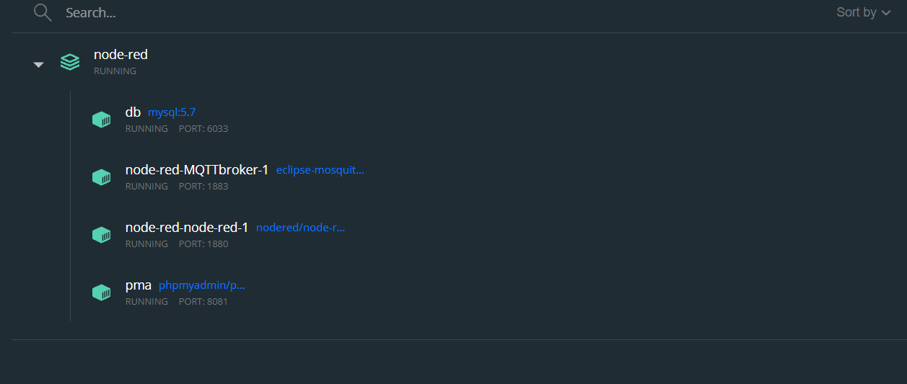 
